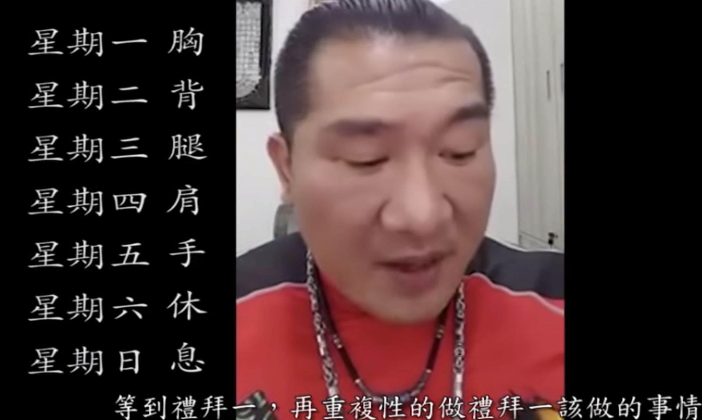
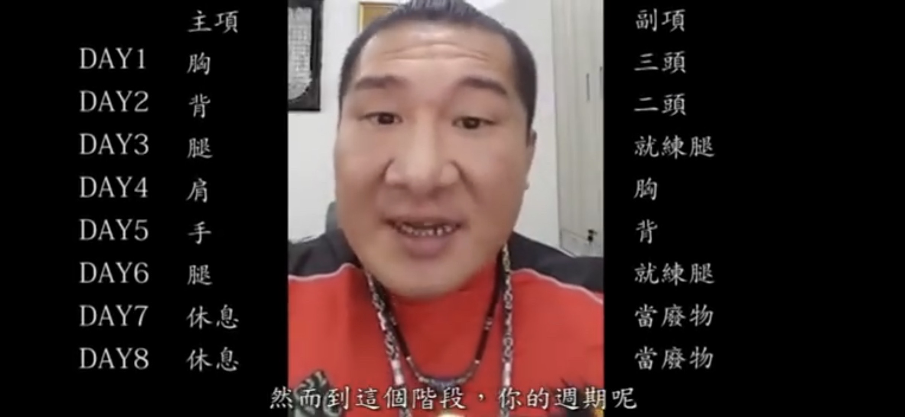
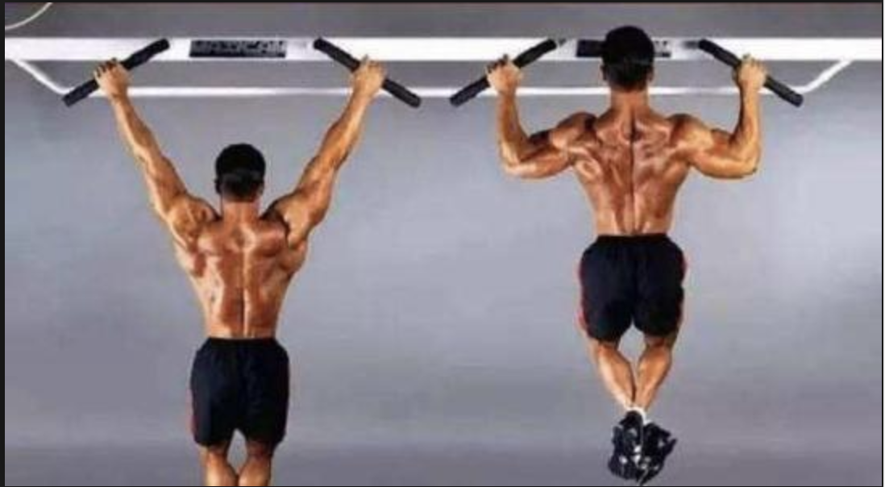
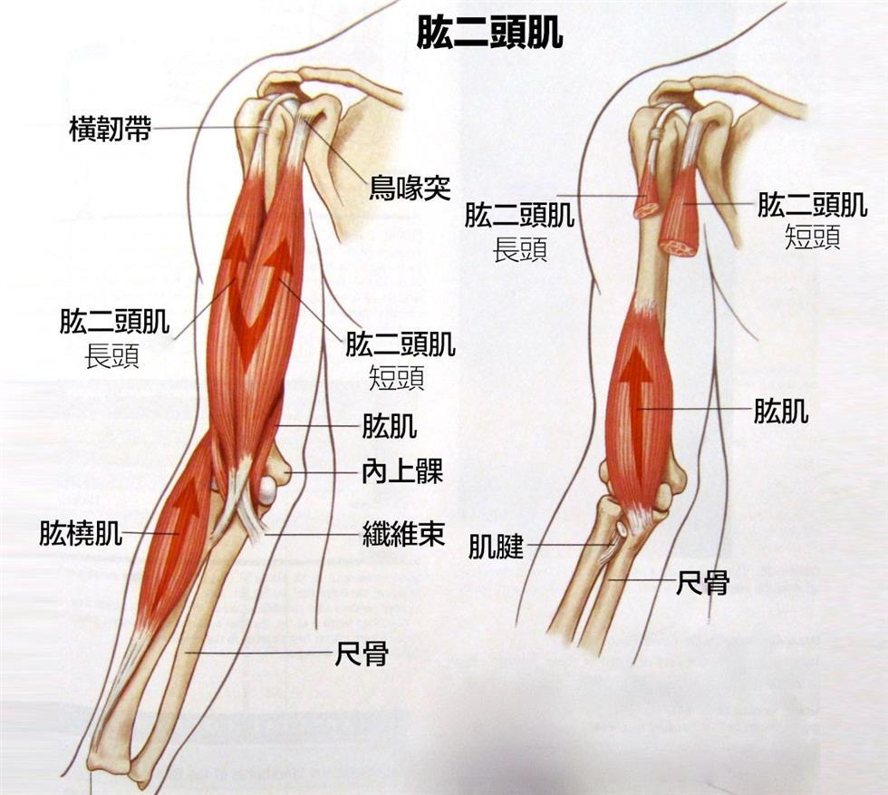
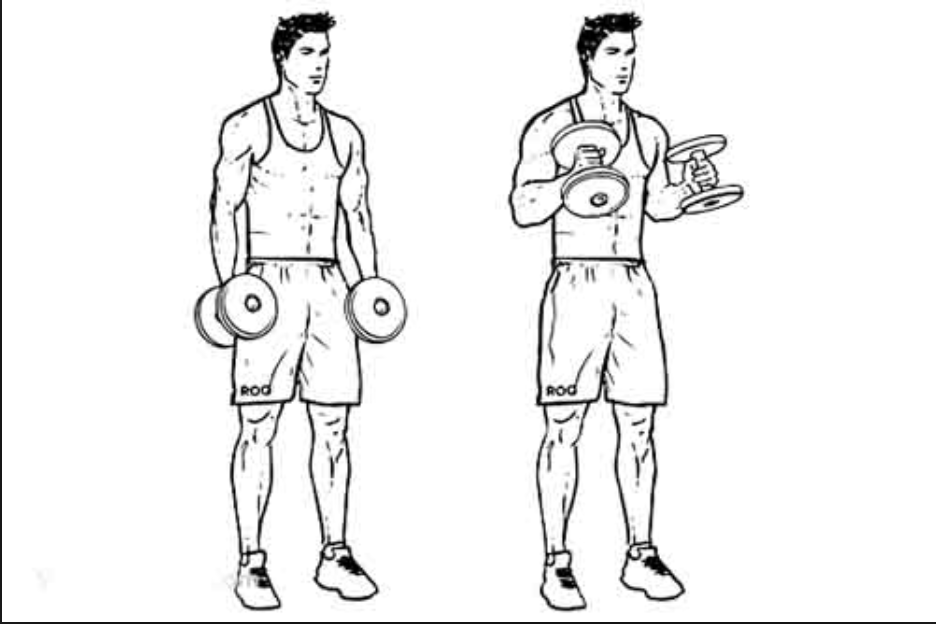
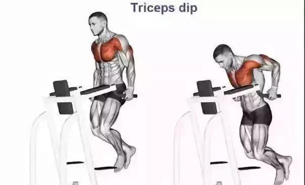
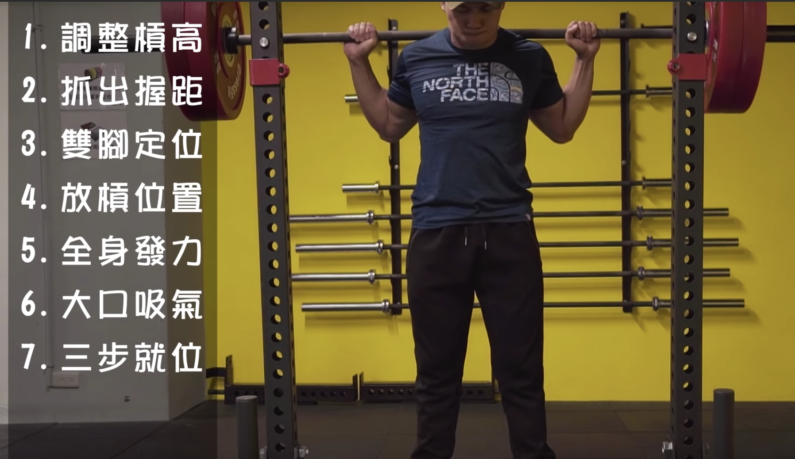
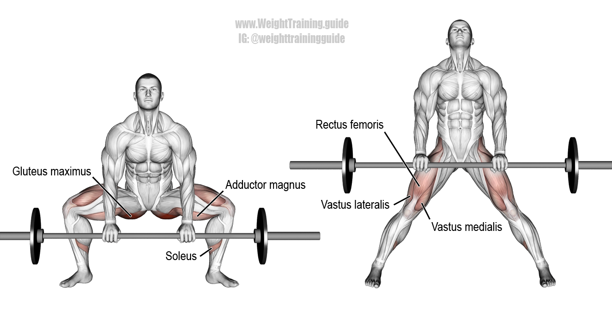
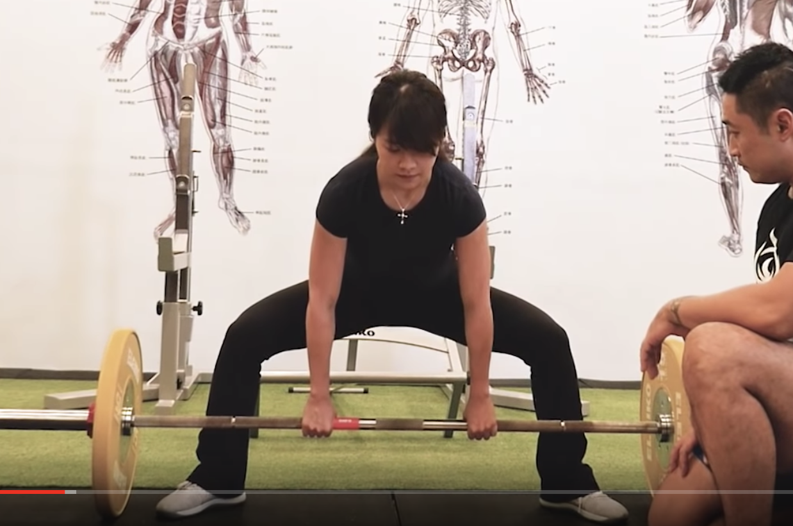

# 变形计 WorkoutGuide

这本手册包含了我和朋友整理的健身动作和指导准则，随着我们段位的提升会不断完善手册（手册的完整程度也代表了我们对健身的理解程度）。大家一起加油吧！:muscle:

## 目录 Content

[1. 课表 Program](#1-课表)

[2. 注意事项 Dos and Don'ts](#2-注意事项-dos-and-donts)

[3. 动作大全 Movements Collection](#3-动作大全-movements-collection)

​		[3.1 热身 Warm up](#31-热身-warm-up)

​		[3.2 背部 Back](#32-背部-back)

​		[3.3 二头肌 Biceps](#33-二头肌-biceps)

​		[3.4 三头肌 Triceps](#34-三头肌-triceps)

​		[3.5 肩部 Shoulders](#35-肩部-shoulders)

​		[3.6 胸部 Chest](#36-胸部-chest)

​		[3.7 腿部 Legs](#37-腿部-legs)

​		[3.8 小肌肉群](#38-小肌肉群)

[4. 身体的奥秘 Secrets of Body](#4-身体的奥秘-secrets-of-body)

[5. 饮食 Diet](#5-饮食-diet)

## 1 课表

### 1.1 初级课表 Beginner's Program

来源：[館長教學-健身新手村三部曲-課表篇](https://www.youtube.com/watch?v=Fg6xKZOq0pw&t=1332s)

### 1.2 进阶课表 Advanced Program

来源：[館長教學-健身新手村三部曲-課表篇](https://www.youtube.com/watch?v=Fg6xKZOq0pw&t=1332s)

## 2 注意事项 Dos and Don'ts

来源：健助师小珂-[【如何练大二头？】你可能正在犯的6个错误！](https://www.youtube.com/watch?v=Yq_6jQmJOqY&t=214s)

- 在做**孤立肌群/单关节**动作时，不应盲目追求大重量，找到能保持完整行程并使肌肉感受最为疲劳的重量即可。更完整的行程可以更好地使肌肉充血，达到更好的训练效果。

## 3 动作大全 Movements Collection

### 3.1 热身 Warm Up

- 猫式往前往后爬（五步）
- 猫式侧向左右爬（十步）
    - 背挺直
    - 膝盖尽可能靠近地面
    - 肩往前推，手臂伸直
    - 步伐不用太大
- 双脚伸直，双手摸地往前爬/脚不动，直至超人俯卧撑
    - 双手不动/双脚往前爬，直至起始位置
    

[返回顶部](#变形计-WorkoutGuide)

### 3.2 背部 Back

背部训练的三种常见方式：

- 多关节运动（引体向上）
- 各种器械/绳索拉（下拉/平拉/上拉）
- 自由重量（哑铃/杠铃划船）

#### 3.2.1 引体向上 Pull-up :key:

- 多关节
- 沉肩/挺胸
- 始终试图收紧肩胛骨，并保持肩部张力

  

#### 3.2.2 单臂哑铃划船 Single Arm Dumbbell Row

- 自由重量

#### 3.2.3 杠铃划船 Barbell Row

- 自由重量

  

#### 3.2.4 坐位下拉（宽距/窄距）Sitdown Machine Pulldown

- 下拉
- 增加背部的宽度/阔背肌

  

#### 3.2.5 坐姿划船 Sitdown Machine Row

- 平拉

  

#### 3.2.6 背部训练教程

shuaisoserious：[【如何练宽背部】—增强背部感受全攻略，圣地亚哥漫展Vlog，以及全天的训练饮食.](https://www.youtube.com/watch?v=6cYhts7FHS4&list=PLFRss9g5ySgQ4zrbEuYnKo9Z9r6tJHriI&index=4&t=779s)

> 包含动作：
> - 引体向上
> - 杠铃划船
> - 坐姿绳索窄握下拉
> - 仰卧绳索面拉
> - 山羊挺身划船

大H：[大H | IFBB PRO 背肌訓練實錄 大H教你打造健體黃金倒三角](https://www.youtube.com/watch?v=7VNXgyu4s6g)

> 包含动作：
> - 单臂哑铃划船 One Arm Dumbbell Row（阔背肌）
> - 固定式反手下拉 Machine Lateral Front Pull Down（阔背肌）
> - 引体向上 Pull Up + 绳索直臂下拉 Cabel Pullover（超级组）
> - 坐姿绳索划船 Cable Row 
> - 绳索下拉 Lat Pulldown

[返回顶部](#变形计-WorkoutGuide)

### 3.3 二头肌 Biceps

二头包含长头（Long Head）和短头（Short Head）。

Compond movement:

- Chin ups / Pull ups
- Rows

#### 3.3.1 杠铃/哑铃弯举 Barbell/Dumbbell Curl :key:

- 主练长头/外侧

#### 3.3.2 锤式弯举 Hammer Curl

- 主练肱肌

#### 3.3.3 牧师凳单臂弯举 Preacher Curl

#### 3.3.4 上斜哑铃弯举 Incline Dumbbell Curl

#### 3.3.5 二头训练教程

KosmoFit：[肌肥大手臂訓練　二頭篇](https://www.youtube.com/watch?v=iRpSiRZ5alY&list=PLFRss9g5ySgQ4zrbEuYnKo9Z9r6tJHriI&index=3&t=0s)

> 包含动作：
> - 单臂牧师凳弯举
> - 站姿哑铃弯举
> - 站姿哑铃单臂前置弯举（内侧）
> - 坐姿哑铃后置弯举（外侧）
> - 站姿锤式弯举（外侧）
> - 站姿杠铃弯举（外侧）

健助师小珂：[如何练粗手臂？（粗剪-你怎么练，手臂就什么样/珂肌计划EP4）](https://www.youtube.com/watch?v=FHCEHKvMGIM&list=PLFRss9g5ySgQ4zrbEuYnKo9Z9r6tJHriI&index=11)

> 包含动作：
> - 器械俯身下压（三头）
> - 牧师凳弯举（二头外侧） + 站姿锤式身前弯举
> - 坐姿哑铃后置弯举

shuaisoserious：[【亲身经历!】如何强化手臂!大容量手臂训练Vlog.The Discipline Series. Ep21](https://www.youtube.com/watch?v=5O1SfsVDMsY&list=PLFRss9g5ySgQ4zrbEuYnKo9Z9r6tJHriI&index=12)

> 包含动作：
> - 绳索下压（三头）
> - 绳索臂屈伸
> - 器械俯身下压（三头）
> - 引体器械下压（三头）
> - 21礼炮
> - 单边锤式弯举（二头）
> - 身前锤式弯举（二头）
> - 站姿绳索二头弯曲（朝内）+ 站姿绳索二头弯曲（朝外）

[返回顶部](#变形计-WorkoutGuide)

### 3.4 三头肌 Triceps

Compond movement: 

- Bench Press
- Dips
- Push Ups

#### 3.4.1 绳索下压 Cable Tricep Push Down

- 此动作主练的是三头肌中的 Lateral Head（单关节动作）
- 固定上臂不动 / 垂直地面， 微微前倾身体，拉至底部时向两侧旋转手腕 / 手腕处于一条线
- 起始时，手肘保持90度

#### 3.4.2 器械俯身下压/双杠臂屈伸 Dip 

- 身体保持垂直地面，前倾会吃到较多胸部
- 双臂尽量靠近身体
- 不必降到太低，示自由度而定，90度即可
- 沉肩

Jeff Nipard：[How To Do Dips For A Bigger Chest and Shoulders (Fix Mistakes!)](https://www.youtube.com/watch?v=yN6Q1UI_xkE)

#### 3.4.3 俯卧撑 Push ups

- 窄距俯卧撑：双臂尽量靠近身体

- 宽距俯卧撑

- 超人俯卧撑

#### 3.4.4 绳索/哑铃臂屈伸 Overhead Cable Extension / Skull Crush

[返回顶部](#变形计-WorkoutGuide)

### 3.5 肩部 Shoulders

- 肩部主要由三角肌组成，其中包含三角肌前束、中束和后束。
- 肩部动作角度因人而异，找到自己合适的角度即可。

#### 3.5.1 哑铃肩推 Dumbbell Shoulder Press :key:

- 复合运动，主练三角肌前束、中束

- 一开始双臂打开的角度不需达到180度，待肩膀习惯后/强度加大后可以慢慢加大角度

  

#### 3.5.2 哑铃侧飞鸟 Dumbbell Side Lateral Raise:key:

- 主练三角肌中束

#### 3.5.3 哑铃后飞鸟 Rear Delt Raise

- 主练三角肌后束

#### 3.5.4 哑铃/杠铃前平举 Dumbbell Front Raise

- 主练三角肌前束

#### 3.5.5 哑铃/杠铃耸肩 Shoulder Shrug

- 主练斜方肌

#### 3.5.4 肩部训练教程

健助师小珂-[如何把肩练大？第一次展示我的练肩神器（全程解析）](https://www.youtube.com/watch?v=HGnevk1zsCA)

>包含动作： 
> -  哑铃侧平举（中束）
> - 坐姿哑铃肩推（前束/中束）
> - 杠铃前平举（前束）
> - 杠铃直立划船（中束）
> - T-bar稳定推举（前束）
> - Cable Machine上提外旋（后束、中束）

大H：[大H | IFBB PRO 肩部訓練實錄 大H教你成為有肩膀的男人](https://www.youtube.com/watch?v=wIgkWDK9DwU&list=PLFRss9g5ySgQ4zrbEuYnKo9Z9r6tJHriI&index=9&t=604s)

>包含动作：
> - 坐姿哑铃肩推 （前）
> - 固定式肩上推 Machine Shoulder Press（前）
> - 固定式侧飞鸟 Machine Side Fly（中）
> - 直立划船 Stand Straight Row（中）
> - 固定式后飞鸟 Machine Reverse Fly（后）
> - 绳索后三角 Cable Reverse Fly（后）

馆长：[【館長健身教學 】肩膀訓練：啞鈴肩推，側飛鳥的重要性](https://www.youtube.com/watch?v=9EkHLHJNJnk&t=3018s)

> - 哑铃肩推
>
> - 哑铃侧飞鸟
>
> - 哑铃后飞鸟
>
> - 杠铃前平举
>
> - 杠铃耸肩（斜方肌）

[返回顶部](#变形计-WorkoutGuide)

### 3.6 胸部 Chest

#### 3.6.1 卧推 Bench Press :key:

- 对肩部压力较大，不建议和肩部前后天训练
- 收紧肩胛骨，往后顶，胸往上顶，脚往下踩，把身体往肩上推（胸腔顶起），屁股和肩部贴住凳子
- 杠位落在胸线上

健人蓋伊：[【槓鈴臥推】訓練技巧與練前伸展｜健人訓練｜2018ep05](https://www.youtube.com/watch?v=VknFj7_shiA)

> - 运动轨迹并非直上直下
> - 抓杠不需太宽/在低点时是最自然舒适的位置即可
> - 握杠位置落在手掌下方

#### 3.6.2 上斜哑铃卧推/杠铃卧推 Incline dumbbell/Bench Press

- 自由重量上斜卧推

- 杠铃上斜卧推/史密斯卧推

#### 3.6.2 器械/绳索夹胸 Machine Chest Fly/Cable Crossover

- Machine Chest fly

- Cable Crossover

#### 3.6.4 胸部训练教程

健助师小珂-[如何练出完美下胸？（快速增强卧推神器首秀！）](https://www.youtube.com/watch?v=OuLz7fZ_WwQ&t=642s)

> 包含动作 Included Movements：
> - 卧推 Bench Press
> - 上斜绳索夹胸 Incline Cable Crossover
> - 上斜固定式夹胸 Incline Machine Crossover
> - 深度俯卧撑（yoga ball）Deep Push up
> - 双杠臂屈伸（身体前倾）Parallel Bar Dip (Lean Forward)

健助师小珂：[【如何练就饱满上胸+胸中缝？】大宝贝Pete地狱式训练 | 被帅soserious一万块滑板种草 | 珂肌计划EP13](https://www.youtube.com/watch?v=3bzex9PIlQE&list=PLFRss9g5ySgQ4zrbEuYnKo9Z9r6tJHriI&index=10&t=446s)

> 包含动作 Included Movements：
> - 史密斯上胸上斜卧推 + 上斜哑铃夹胸卧推（上胸、内胸）
> - 哑铃平躺飞鸟 + 哑铃平躺推举（胸大肌）
> - 固定式上斜推举 Machine Incline Chest Press
> - 固定式坐姿平推（世纪组）Machine Sitdown Push (Century Set)

shuaisoserious：[【如何练大上胸!】把我爸搭配成一个"潮男"!.The Discipline Series. Ep23(新年特辑)](https://www.youtube.com/watch?v=yXRo9Mms2ZU&list=PLFRss9g5ySgQ4zrbEuYnKo9Z9r6tJHriI&index=7)

> 包含动作：
> - 史密斯上胸上斜卧推
> - 哑铃上斜飞鸟 + 哑铃上斜推举
> - 固定式坐姿平推
> - 绳索夹胸

大H：[大H | IFBB PRO 胸肌訓練實錄 大H教你打造厚實胸肌](https://www.youtube.com/watch?v=nKjAD5hN3Go&list=PLFRss9g5ySgQ4zrbEuYnKo9Z9r6tJHriI&index=16)

> 包含动作：
> - 哑铃躺姿卧推
> - 哑铃上斜卧推
> - 坐姿固定式夹胸
> - 前倾绳索夹胸（力线和手臂平行）
> - 固定式坐姿平推（降重组频率可以加快）
> - 双杠臂屈伸（身体前倾）

[返回顶部](#变形计-WorkoutGuide)

### 3.7 腿部 Legs

#### 3.7.1 深蹲 Back Squat :key:

- Hip below knee joint 
- 膝盖不必要不超过脚尖
- 先把气吐出去，让核心变紧，然后保持这种感觉再吸气

来源：健人蓋伊 - [專注完美的【背槓深蹲】起槓篇｜健人訓練｜2017ep15](https://www.youtube.com/watch?v=xEp7xdftYTY)

深蹲时肘关节疼痛：

1. 肩关节和胸腔活动度不够，导致手肘位置前移，造成疼痛 （拉伸胸部）
2. 肩与肩胛连接肌肉不够强（外旋练习）

3. [杠铃深蹲手背不过去怎么办？深蹲胳膊撇不过去怎么办？](https://zhuanlan.zhihu.com/p/49021992) (改善圆肩)

#### 3.7.2 罗马尼亚硬拉 Romania Deadlift

- 主练大腿后侧腘绳肌（股二头肌）与臀部
- 膝盖只要微弯即可，杠尽量贴近小腿
- Lift once barbell is lower than your knees
- Keep your back straight

#### 3.7.3 屈腿硬拉 Traditional Deadlift :key:

- 重量最大的硬拉
- 手先下去随便抓，然后屁股往后上方顶，这时腿会变得比较直（很像罗马尼亚硬拉），背挺直，然后腿弯下来，屁股保持顶的感觉，然后屁股往前顶，背始终挺直，身体会自然把杠铃带起
- 手往外转，这样会调动更多的肌群

#### 3.7.4 相扑式硬拉 Sumo Deadlift

来源：館長成吉思汗 - [館長硬舉教學 2017](https://www.youtube.com/watch?v=Td_pWCfQzWg&t=586s)

#### 3.7.5 弓箭步 Lunge 

- 负重弓箭步

#### 3.7.5 深蹲辅助训练

- 单脚罗马尼亚硬拉
    - 摸地
    - 转胯
- 单脚罗马尼亚深蹲
  
    - 抬起的脚用力往后踩在凳子上
- 抱着杠片深蹲
- 仰面躺地/手脚抬起
    - 异侧手脚同时往外
    - 保持腰部贴地
    
    

#### 3.7.6 腿部训练教程

Jeff Nippard：[The Most Effective Science-Based Leg Day 2019 (New Upper/Lower Split)](https://www.youtube.com/watch?v=_kLBi8tF6Kk)

> 包含动作：
> - 热身 Warm up (楼梯机 Stairmaster 5m)、拉伸 Stretching (3m-4m)
> - 深蹲 Back Squat
> - 着重克服动作的罗马尼亚硬拉 Eccentric Accentuated Romania Deadlift
> - 哑铃弓步交替走路 Walking Lunge Dropset
> - Single Leg Eccentric Leg Extension
> - Lying Leg Curl
> - Straight Leg Calf Raise
> - Cable Crunch（focus on spain）

大H：[大H | IFBB PRO 腿肌訓練實錄 大H教你如何練出健體腿 健體要練腿嗎？](https://www.youtube.com/watch?v=_gjkeqoUsGE&list=PLFRss9g5ySgQ4zrbEuYnKo9Z9r6tJHriI&index=31&t=0s)

> - 固定式腿推 Leg Press
> - 深蹲 Back Squat
> - 罗马尼亚硬拉 Romania Deadlift
> - 固定式腿后弯举 Lying Leg Curl
> - 固定式腿前屈伸 Leg Extension

[返回顶部](#变形计-WorkoutGuide)

### 3.8 腹部

#### 3.8.1 卷腹

- 绳索卷腹
- 平躺卷腹

#### 3.8.2 腹部训练教程

短腿小萝卜_babycarrot：[【干货】减脂期如何高效打造完美腹肌](https://www.youtube.com/watch?v=o6cMQV0wCNI)

> - 绳索卷腹
> - 平板举腿
> - V字摸脚尖（负重）
> - 悬垂举腿
> - 绳索转体登山者（腹外斜肌）

### 3.9 小肌肉群

- 招财猫（肩胛骨后侧）

- 侧向招财猫（胸后侧）

  

[返回顶部](#变形计-WorkoutGuide)

## 4 身体的奥秘 Secrets of Body

丁香园莫然：[为什么胖都胖在腰部？](https://m.dxy.com/column/2493)

> - 成年后再减肥，只是脂肪细胞体积的萎缩，并不会减少脂肪细胞的数量。更残酷的是腹部由于有大量脂肪细胞的存在，一旦「胖」就会特别显眼。所以，好身材要从「娃娃」抓起。 
> - 男女生发胖的不同点（不同性激素的作用）

知乎大佬详解三头肌：[（肱三头篇全解析）拿什么强壮你？我的手臂！](https://zhuanlan.zhihu.com/p/40610317)

知乎大佬详解二头肌： [（肱二头篇全解析）拿什么强壮你？我的手臂！](https://zhuanlan.zhihu.com/p/40606370)

Stan Efferding：[Stan Efferding KOMPLETTES Seminar in THOR's Powergym](https://www.youtube.com/watch?v=BeOc7TRo9Os&list=LL8Fx57eOFoHAaTHtt8vKbDg&index=82&t=6979s)

> - Wake up at the same time every morning
> - 牛肉（红肉）的营养价值远高于鸡肉
> - 睡眠呼吸暂停征（Sleep Apnea），会升高血压、增加患心脏方面的疾病的概率，可以使用CPAP在睡眠时扩张呼吸道，从而避免打鼾。（睡醒感觉疲惫，打鼾严重，极有可能患有睡眠呼吸暂停）

如何选择一款适合自己的CPAP呼吸机：[How to choose… Positive Airway Pressure (PAP) therapy](https://snorer.com/information-guides/choose-positive-airway-pressure-pap-therapy/)

> - 在睡眠时如果有打开嘴巴习惯的人，将不适合鼻罩（nasal mask），而需要全脸罩（full face mask）或者口鼻罩（oro-nasal mask）
> - 呼吸机工作的原理

aj3423：[胆碱能型荨麻疹（遇热过敏型）](https://www.cnblogs.com/aj3423/p/7727078.html)

> - 病理：胆碱能型荨麻疹（cholinergic urticaria），是身体对乙酰胆碱的抗性低于正常水平，而在人体运动、受热、情绪紧张、进食热饮或乙醇饮料后，躯体深层温度升高，脊髓分泌的用来刺激皮肤出汗的乙酰胆碱会引起身体的过敏性反应
> - 表现为皮肤出现很多小点状的红包，伴有剧痒
> - 提高身体血液中含氧量（血氧量），或许对病情有帮助

百度经验：[手腕骨折后康复训练](https://jingyan.baidu.com/article/cbcede071e979e02f40b4d95.html)

卓恒: [卓叔增重 丨 增重20斤，肚腩也出来了，怎么办？](https://zhuanlan.zhihu.com/p/20422548)

> - 练好身材的过程是这样的：开始→增肌→减脂→练成

[返回顶部](#变形计-WorkoutGuide)

## 5 饮食 Diet

以大服人：[［运动营养学］——增肌应该怎么吃1.0](https://zhuanlan.zhihu.com/p/29930704)

> - 双非期（非增肌期、非减脂期）蛋白质每日摄入：1 g / kg
> - 增肌期蛋白质每日摄入：1.2（低频）～1.5 g（高频） / kg，碳水摄入：6～8 g / kg，脂肪摄入等同于蛋白质
> - 若每天能有意识的多吃鸡胸，少油糖，增加碳水其实对身材已近有很大的进步

Jeff Nippard: [5 “Superfoods” I Recently Added To My Diet (Science Explained)](https://www.youtube.com/watch?v=hMmUc8NpC7k)

> - Kiwifruit 奇异果
> - Blueberry 蓝莓 
>   - 1 cup / Day
> - Garlic 蒜 
>   - Prevent body from getting cold
> - Spinach 菠菜（深绿色蔬菜）
> - Mussel 蚌

瘦龙健康: [各种烹饪方式与食物营养流失](https://zhuanlan.zhihu.com/p/34406612)

> 只要你把煮菜或炖肉的汤都喝掉，100%的矿物质和70 – 90%的维生素B也就被你吃进肚里了，因为煮过的菜或肉，营养都在汤里了。

瘦龙低碳: [植物油健康吗？我们到底怎么选择食用油？](http://www.chinalowcarb.com/zhiwuyou)

> - 需要尽量少摄入的是，含有omega-6太多的植物油: 大豆油，菜籽油，玉米油，红花油，葵花籽油，棉花籽油，花生油，芝麻油，菜籽油，稻米油。
> - 推荐用油: 椰子油（排名第一），橄榄油，黄油，牛油果，鱼油，猪油等动物油，棕榈油，亚麻籽油。

### 5.1 蛋白质

**1. 牛肉**

**2. 鸡胸肉**

**3. 三文鱼**

### 5.2 碳水

**1. 米 Rice**

**2. 面条 Noodles**

**3. 吐司面包（Multi-seeds）**

### 5.3 脂肪 Fat

**1. 花生酱**

**2. 坚果**

### 5.4 微量元素

**1. 维生素D**

- 晒太阳可以补充维生素D

**2. 维生素B**

- 富含维生素B1的食物：豆类、糙米、牛奶、家禽
- 富含维生素B2的食物：瘦肉、蛋黄、糙米及绿叶蔬菜，小米

**3. Vitamin C**

- Tomato: 

**3. 钙**

丁香医生范志红：[钙，你补对了吗？10 个忠告远离补钙误区](https://dxy.com/column/3051)

> 膳食中钙的主要来源：
> - 奶类（牛奶、酸奶、奶酪）
> - 豆制品（卤水豆腐、石膏豆腐、豆腐干等）
> - 深绿色的叶菜（小油菜、小白菜、芥蓝等）
> - 芝麻酱、坚果、带骨小鱼和虾贝类等

[:point_up: 返回顶部](#变形计-WorkoutGuide)

